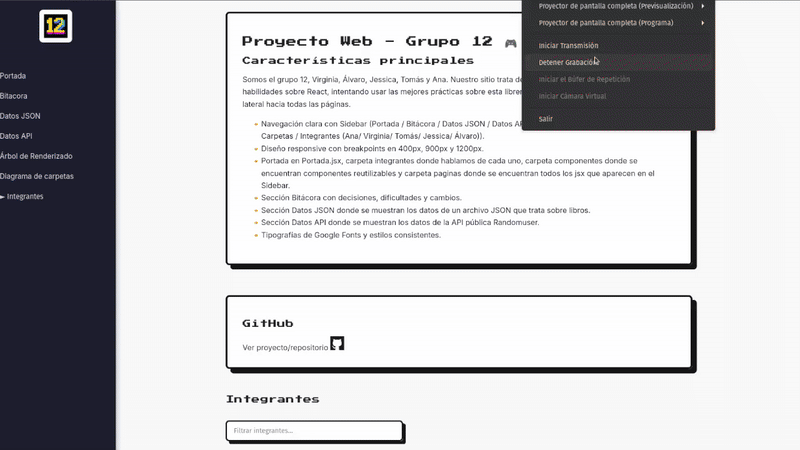
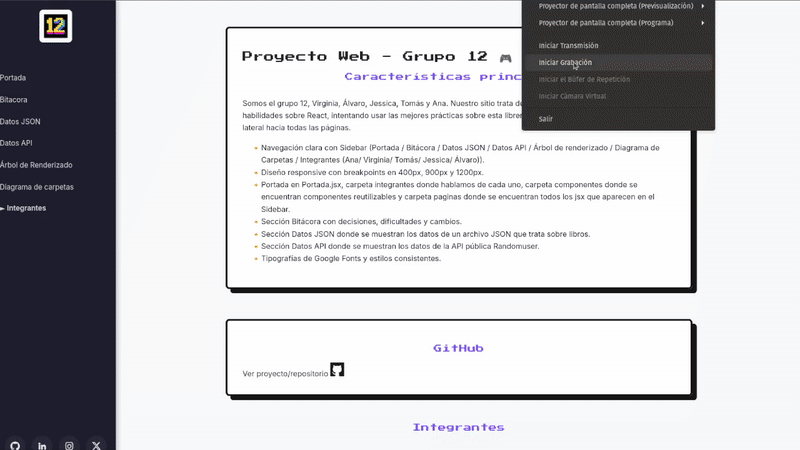
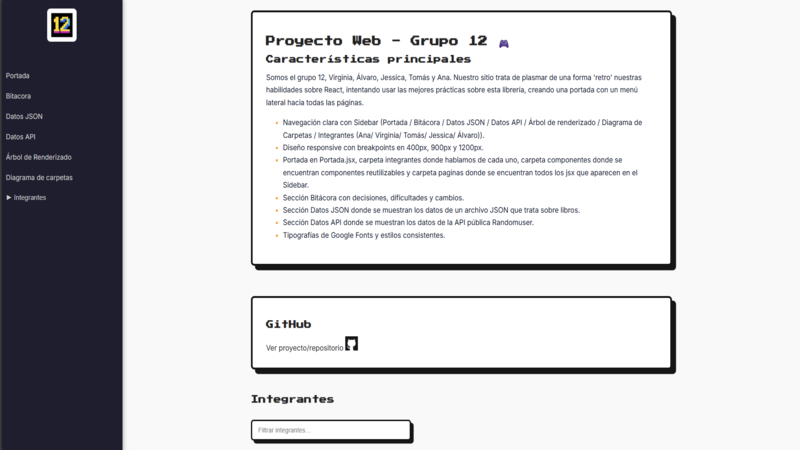
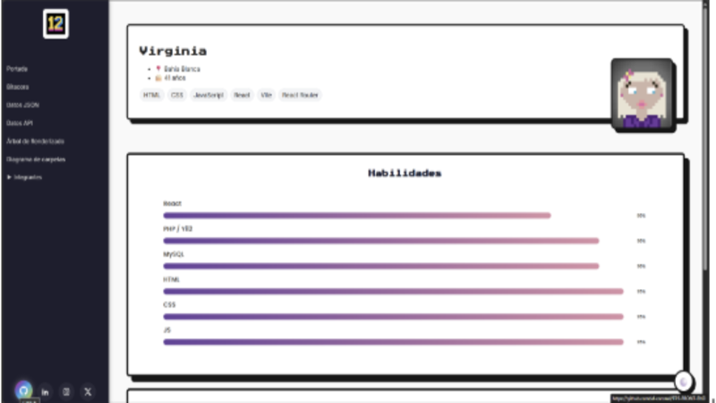

# TP DE PRESENTACIÓN DEL GRUPO 12

## Descripción
En este trabajo se trata de plasmar las habilidades de cada integrante del equipo en cuanto a React, ayudándonos porque tenemos diferentes niveles de conocimientos. Se trata de una **presentación interactiva** del Grupo 12, donde cada integrante diseñó su propia tarjeta personal aplicando conocimientos de **React**.  
La idea fue trabajar en equipo, compartir estilos y experimentar con diferentes efectos visuales y funcionalidades, respetando la estética retro y creativa que nos caracteriza.
Lo importante es el uso de componentes reutilizables con y sin props, con la utilización de children, como el uso de useState, useCallback, useEffect,useRef y useMemo y a eso le sumamos el React Router.

## Mejoras
### Mejora 1: Búsqueda/Filtrado en JSON Local (Ana)
- En la página Datos JSON (sobre libros) se implementaron 5 select(dropdown) para realizar filtros por título, autor, género, año de publicación e idioma. Se pueden unir diferentes filtros, por ejemplo: género con idioma. Si no hay coincidencias saldrá un h2 mostrando "No hay libros que se ajusten a los filtros".


### Mejora 2: Barras de Progreso de Habilidades (Jessica)

**Descripción:**  
Se implementaron barras de progreso animadas para mostrar visualmente el nivel de habilidades. Cada barra refleja el porcentaje de dominio de la habilidad correspondiente (HTML, CSS, JavaScript, Trabajo en equipo, Diseño UI).  

**Antes:**  
  
*(Aquí se veían solo los nombres y porcentajes sin animación ni barra visual)*

**Después:**  
  
*(Ahora se muestran barras animadas con la paleta de colores del sitio)*

### Mejora 3: Animaciones (Tomas)

**Descripción:**  
Se implementaron **transiciones (`transition`) y animaciones (`@keyframes`)** con **CSS puro** para generar efectos visuales dinámicos en tarjetas, botones y la carga de las páginas.  
Los efectos buscan mejorar la experiencia visual sin afectar el rendimiento, manteniendo la estética retro del sitio.  

- En las **tarjetas** se añadieron animaciones de aparición con *fade-in* y *slide-up*.  
- En los **botones**, se aplicaron transiciones suaves en el hover con cambios de color y escala.  
- En la **carga de páginas**, se utilizó una animación de entrada progresiva de los elementos para dar sensación de fluidez.  

**Antes:**  

*(Los elementos aparecían de forma estática sin transiciones ni efectos visuales)*  

**Después:**  
 
*(Los elementos ahora cuentan con animaciones suaves y coherentes con la estética general del proyecto)*  


### Mejora 4: Botones de redes sociales en el Sidebar (Virginia)

**Descripción:**  
Se agregaron botones de redes sociales **ciculares** al pie del sidebar azul, con **animación al hover**:
- Hover: leve *lift* (+translateY) y *scale*; cambio de fondo a un **degradado** con los colores del ícono del sitio. 
- Implementación: SVGs inline (sin dependencias), bloque pegado abajo con `margin-top: auto` dentro del sidebar (que usa `display: flex; flex-direction: column;`).

**Antes:**  


**Después:**  



*(Detalle de los botones y su efecto de hover)*  

### Mejora 5: ...

**Descripción:**  
....
**Antes:**  
....

**Después:**  
.....

## 🛠️ Tecnologías utilizadas
- **React**
- **Google Fonts**

## 🚀 Instalación y uso
1. Clonar este repositorio:
   ```bash
   git clone https://github.com/af-coronel/TP3-FRONT-END.git
2. Ver si está instalado node   node -v
3. Poner este comando  npm install  para instalar todas las dependencias
4. Poner este comando npm run dev  para correr el proyecto en modo desarrollador, creando un servidor local.

## Enlace del sitio
[ENLACE VERCEL]()
